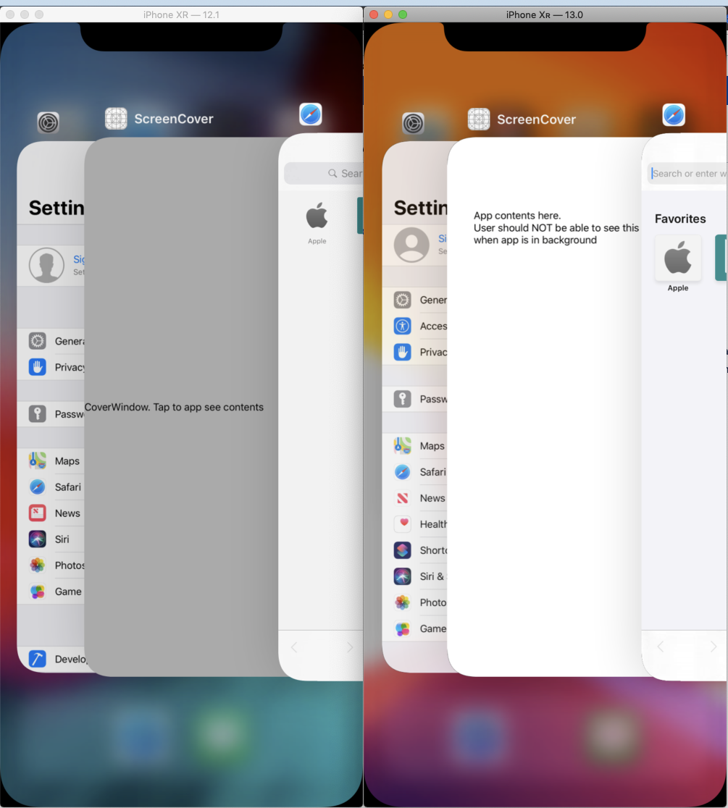

Sample project that reproduces possible bug in iOS13 beta (17A5547d).

## Objectice:

I want is to cover my app contents when it enters the background. 

## Bug 

### Steps to reproduce:

1. Start the app (ViewController is shown)
2. Make the app go to background. (applicationDidEnterBackground is called and an extra window is placed on top of everything to cover the contents of the app)
3. Show the app in the app switcher

### Expected behaviour:

Extra window created in applicationDidEnterBackground shows. ViewController should not be visible.

### Current behaviour in iOS13 betas:

Extra window created in applicationDidEnterBackground is NOT showing. ViewController is visible.

Extra info: When app enters foreground again then extra window shows (this is too late). It looks like changes/modifications in windows in iOS13 applicationDidEnterBackground is not reflected in screen until app goes back to foreground again

